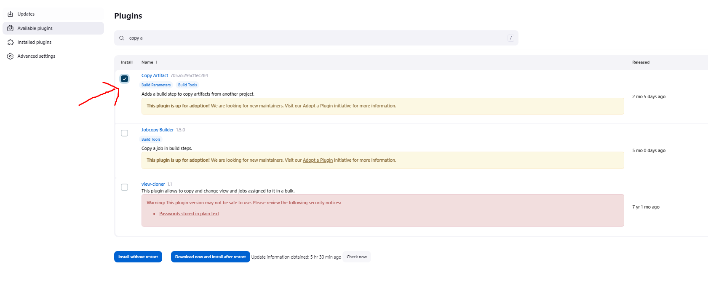
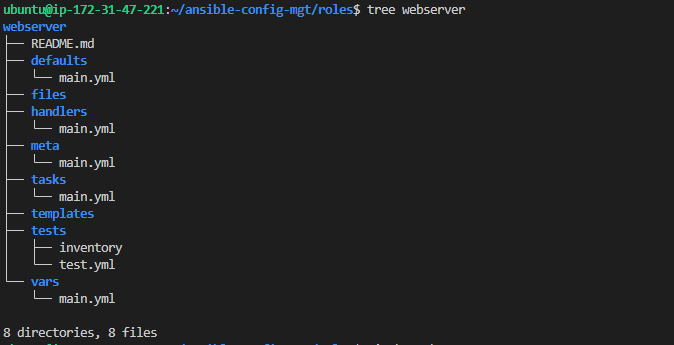
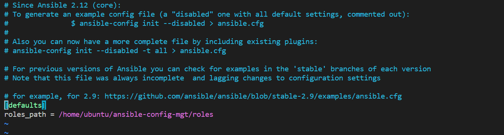
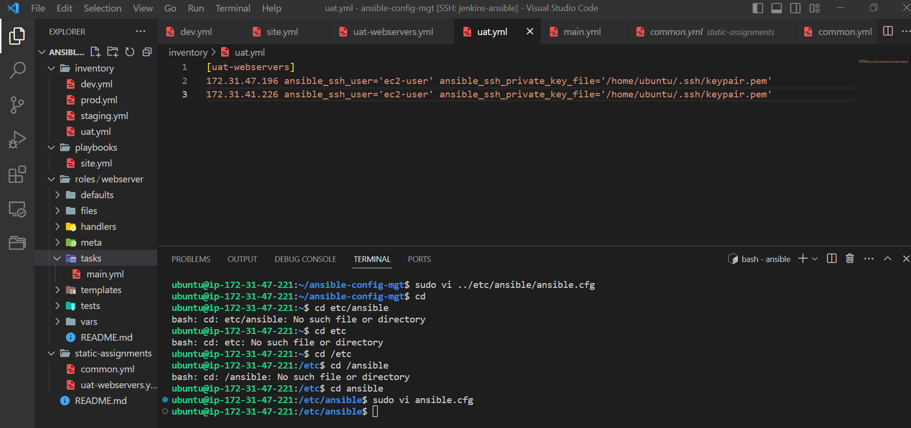
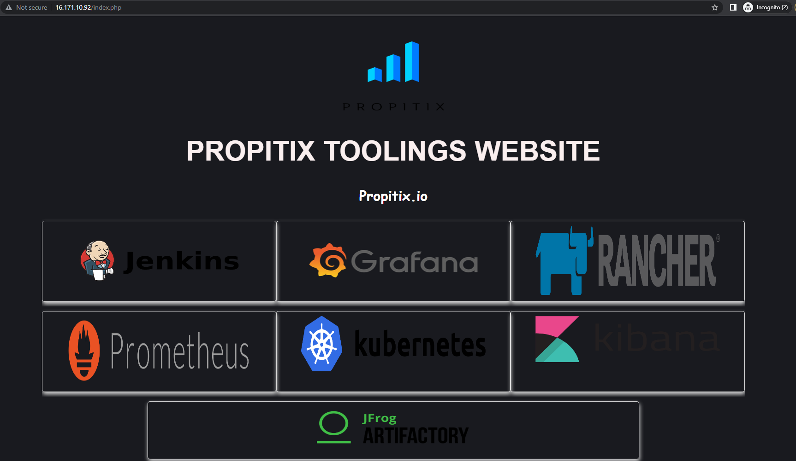
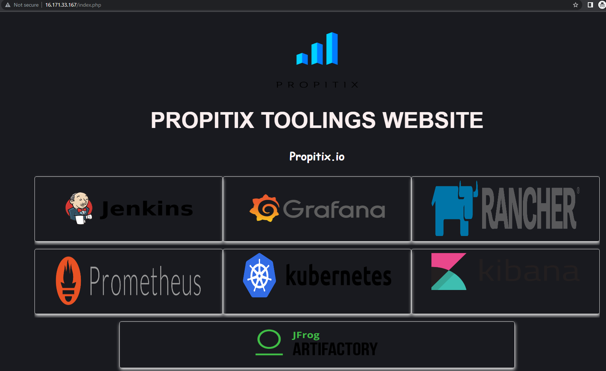

# ANSIBLE REFACTORING AND STATIC ASSIGNMENTS (IMPORT AND ROLES)

In this project, I will continue working with ansible and make some code improvements. I'll be refactoring my ansible code, creating assignments and using the import functionality. Imports allows to effectively re-use previously created playbooks in a new playbook which allows to re-organise tasks and reuse them when needed. 

## JENKINS JOB ENHANCEMENT
A new directory will be created on the jenkins server so that all artifacts will be stored there. The copy artifact plugin will be required for this. 
The new directory created is ansible-config-artifact where we will store there all artifacts after each build 
`sudo mkdir /home/ubuntu/ansible-config-artifact`
Permissions to the directory are changed so that jenkins can save files there - `sudo chown -R jenkins:jenkins /home/ubuntu/ansible-config-artifact`
A freestyle project is created named save_artifacts so that it will be triggered upon completion of the existing ansible project. The main idea of save_artifacts project is to save artifacts into /home/ubuntu/ansible-config-artifact directory. To achieve this, create a Build step and choose Copy artifacts from other project, I will be using ansible as a source project and /home/ubuntu/ansible-config-artifact as a target directory.
When both jenkins jobs have completed one after another - we will see the files inside the /home/ubuntu/ansible-config-artifact directory and it will be updated with every commit to your master branch.



# REFACTOR ANSIBLE CODE BY IMPORTING OTHER PLAYBOOKS INTO SITE.YML

Before refactoring the codes, the latest code is pulled down from the main branch and a new branch is created named refactor.
A new folder is created in the root of the repository named static-assignments. This folder is where all other children playbooks will be stored. This is merely for easy organizatoin of your work. Within playbooks folder, create a new file and name it site.yml - This file will now be considered as an entry point into the entire infrastructure configuration. Other playbooks will be included here as a reference. 
Inside the site.yml file, import common.yml playbook

```
---
- hosts: all
- import_playbook: ../static-assignments/common.yml

```

The code above uses built in import_playbook ansible module. 

# CONFIGURE UAT WEBSERVERS WITH A ROLE 'WEBSERVER'

We will be configuring 2 new web-servers as uat. we will be using a dedicated role to make our configuration reusable. 

2 instances are launched using RHEL 9 image, we will be using them as our uat servers (web1-UAT) and (web2-UAT)

A role directory is created using the following commands

```
mkdir roles
cd roles
ansible-galaxy init webserver
```



The inventory is updated `ansible-config-mgt/inventory/uat.yml` file with IP addresses of the 2 UAT sebservers. 

```
[uat-webservers]
<Web1-UAT-Server-Private-IP-Address> ansible_ssh_user='ec2-user' ansible_ssh_private_key_file='/home/ubuntu/.ssh/keypair.pem'

<Web2-UAT-Server-Private-IP-Address> ansible_ssh_user='ec2-user' ansible_ssh_private_key_file='/home/ubuntu/.ssh/keypair.pem'
```
In /etc/ansible/ansible.cfg file, we uncomment roles_path string and provide a full path to the roles directory `roles_path    = /home/ubuntu/ansible-config-mgt/roles`, so Ansible knows where to find configured roles.


In the tasks directory, I update the main.yml file with the following code. 

```
- name: install apache
  become: true
  ansible.builtin.yum:
    name: "httpd"
    state: present

- name: install git
  become: true
  ansible.builtin.yum:
    name: "git"
    state: present

- name: clone a repo
  become: true
  ansible.builtin.git:
    repo: https://github.com/<your-name>/tooling.git
    dest: /var/www/html
    force: yes

- name: copy html content to one level up
  become: true
  command: cp -r /var/www/html/html/ /var/www/

- name: Start service httpd, if not started
  become: true
  ansible.builtin.service:
    name: httpd
    state: started

- name: recursively remove /var/www/html/html/ directory
  become: true
  ansible.builtin.file:
    path: /var/www/html/html
    state: absent

```

Within the static assignments folder I create a new assignments for uat-webservers in the uat-webservers.yml. This is where the roles will be referenced. 

```---
- hosts: uat-webservers
  roles:
     - webserver

```

In the site.yml, it is updated with the following code

```
---
- hosts: all
- import_playbook: ../static-assignments/common.yml

- hosts: uat-webservers
- import_playbook: ../static-assignments/uat-webservers.yml

```



# CODE COMMIT & TEST 

The code is commited to the git repo and merged into the master branch. Jenkins builds the artifacts. 

I run the playbook with the following command against the uat inventory..
```
sudo ansible-playbook -i /home/ubuntu/ansible-config-mgt/inventory/uat.yml /home/ubuntu/ansible-config-mgt/playbooks/site.yml

```

The sites can be seen to be up on the two webservers. 





